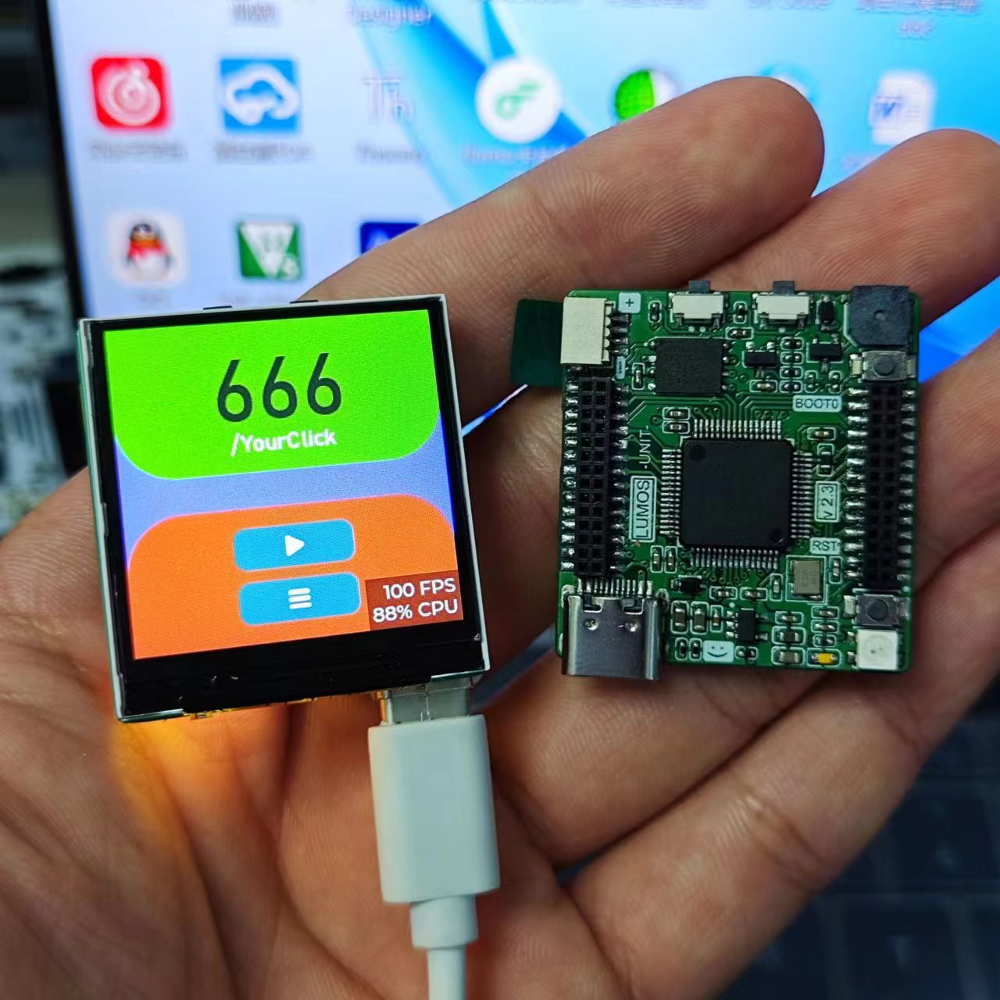
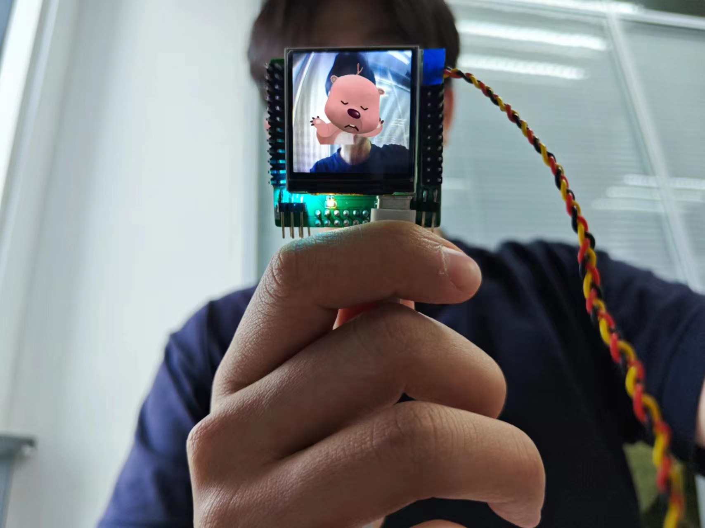
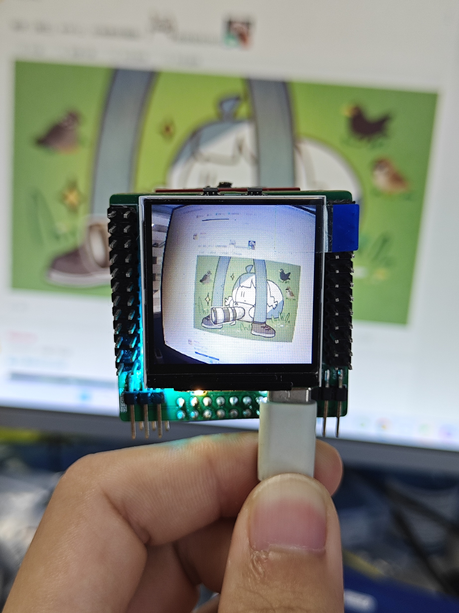

# Color-Tracer

### Author: @kkl

> Some DEMOs for STM32F405&OV2640
> 初次尝试摄像头的一些项目样本，这是好久以前的项目，这里是重新整理的仓库。

---

## 关于程序

### 在LCD屏幕上显示摄像头画面

> 1. 全屏显示(240x240)

### 对特定的颜色进行识别与跟踪

> 2. 颜色识别(白、红、绿)

默认烧录为识别追踪浅绿色（草绿色），可以前往`dcmi.c`文件当中修改`TARGET_CONDI Conditionred`变量为其他色彩阈值。

演示效果如下：

### 识别标准数字(0-9)

> 3. 数字识别(模板匹配)

## 关于硬件

硬件是我自己制作的基于STM32F405的HMI开发板LUMOS，但不是最新的版本[最新版本戳这里:p](https://oshwhub.com/hugego/lumos-stm32f405-based-hmi-core-board).

您可以到`2.Hardware`当中获取旧版本的PCB打样文件，top为顶板，base为底板，但是本项目不建议复刻。

外观展示如下：

  

